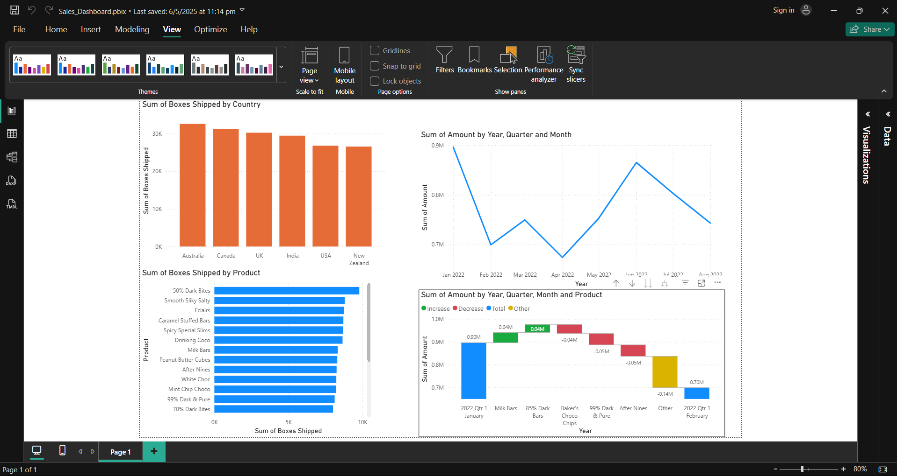
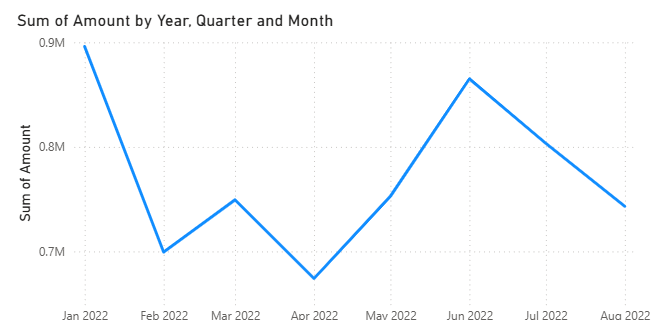
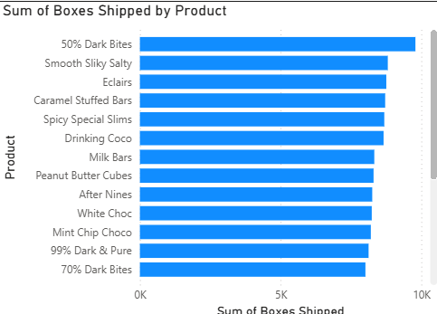

# 📊 Sales Dashboard Analysis

An interactive sales analytics dashboard developed using **Power BI** to visualize KPIs, sales trends, shipment analysis, and business performance metrics.

---

## 🚀 Project Overview

This project focuses on analyzing sales performance across different countries, products, and time periods using interactive Power BI visualizations.

The dashboard helps identify:

- 📈 Sales trends over time
- 🌍 Country-wise shipment performance
- 📦 Product-wise shipment analysis
- 💰 Revenue fluctuations and business insights

---

## 🛠️ Tools & Technologies Used

- **Power BI**
- **Data Visualization**
- **Business Intelligence**
- **Dashboard Design**

---

## 📷 Dashboard Preview

### 🔹 Dashboard Overview

---

### 🔹 Sales Trend Analysis

---

### 🔹 Product Performance Analysis

---

## 📊 Key Insights

- Australia recorded the highest shipment volume.
- Sales revenue fluctuated across different months.
- Certain products contributed significantly more to total shipments.
- Waterfall analysis highlighted revenue increase and decrease patterns.

---

## ✨ Features

- Interactive dashboard interface
- Country-wise shipment analysis
- Product performance tracking
- Monthly sales trend visualization
- Business KPI monitoring
- Clean and responsive dashboard design

---

## 📁 Project Files

- `Sales_Dashboard.pbix` → Power BI dashboard file
- `dashboard-overview.png` → Full dashboard preview
- `sales-trend-analysis.png` → Trend analysis visualization
- `product-performance.png` → Product analysis visualization

---

## 👨‍💻 Author

### Abhinandan Malik  
Aspiring Data Analyst passionate about transforming data into actionable business insights using Power BI and data visualization.

🔗 LinkedIn: https://www.linkedin.com/in/abhinandan-malik-6317192a0/
